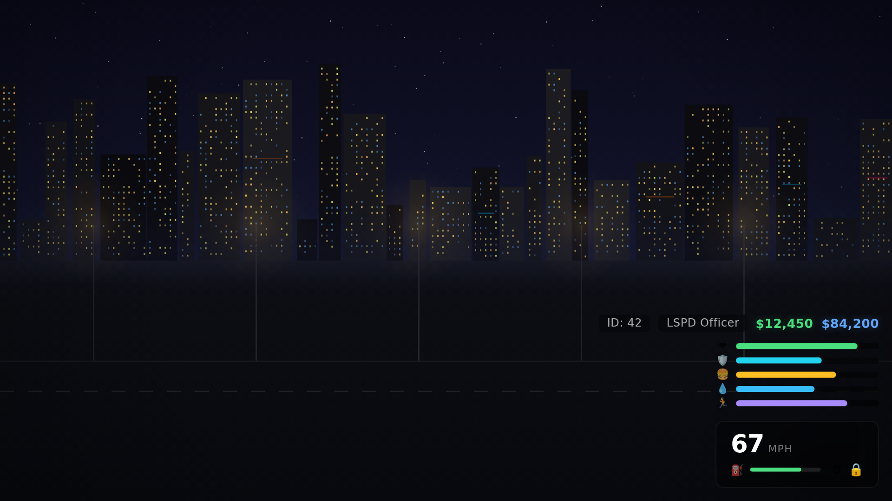
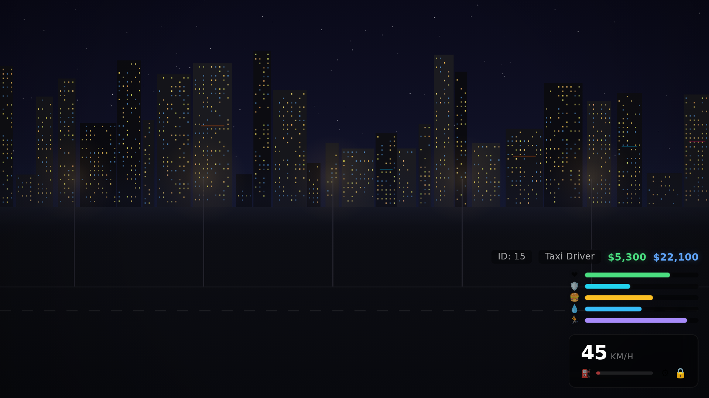

# Helix HUD

A high-performance, customizable HUD for FiveM servers. Built with React + TypeScript and powered by [helix_lib](https://github.com/Helix-Scripts/helix-lib).

**Sub-0.05ms idle resmon** — performance is the brand.

## Preview


### Dark Theme
| On Foot | In Vehicle | Combat |
|---------|-----------|--------|
|  |  |  |

### Light Theme


### Vehicle Warnings


## Features

### Status Bars
- **Health** — synced to player health
- **Armor** — synced to player armor (hidden when 0)
- **Hunger** — framework-dependent (Qbox/QBCore/ESX)
- **Thirst** — framework-dependent
- **Stress** — framework-dependent (off by default)
- **Stamina** — from native GetPlayerStamina (hidden when full)

### Info Display
- Cash / Bank balance (event-driven, not polled)
- Job title from framework
- Server ID

### Vehicle HUD
- Speed (km/h or mph toggle)
- Fuel level (auto-detects LegacyFuel, ox_fuel, cdn-fuel)
- Seatbelt indicator
- Engine status
- Smooth slide-in animation on vehicle entry

### Performance
- Health/armor/stamina: polled every 200ms (configurable)
- Cash/job: event-driven only — zero polling overhead
- Vehicle data: polled every 100ms only when in vehicle
- NUI updates batched — single message per tick
- All polling stops when HUD is hidden or pause menu is open
- **NUI bundle: ~48 KB gzipped**

## Supported Frameworks

| Framework | Status | Notes |
|-----------|--------|-------|
| Qbox | Full support | Primary target |
| QBCore | Full support | |
| ESX | Full support | |
| Standalone | Partial | Health/armor/stamina only |

## Dependencies

- [helix_lib](https://github.com/Helix-Scripts/helix-lib) — required shared library

## Installation

1. Ensure `helix_lib` is installed and started before this resource.
2. Clone or download this repository into your server's `resources/` directory.
3. Build the NUI:
   ```bash
   cd nui
   npm install
   npm run build
   ```
4. Add `ensure helix_hud` to your `server.cfg` (after `ensure helix_lib`).

## Configuration

Edit `config.lua` to customize the HUD. Everything is toggleable:

```lua
Config = {
    framework = 'auto',

    elements = {
        health = true,
        armor = true,
        hunger = true,
        thirst = true,
        stress = false,    -- off by default
        stamina = true,
        cash = true,
        bank = false,      -- off by default for privacy
        job = true,
        serverId = true,
    },

    vehicle = {
        enabled = true,
        speedUnit = 'kmh', -- 'kmh' or 'mph'
        fuelScript = 'auto',
        seatbelt = true,
    },

    theme = 'dark',            -- 'dark' or 'light'
    position = 'bottom-right', -- 'bottom-right', 'bottom-left', 'bottom-center'
    scale = 1.0,
    hideInPauseMenu = true,

    updateIntervals = {
        health = 200,
        vehicle = 100,
    },
}
```

## Contributing

Please see the [organisation contributing guidelines](https://github.com/Helix-Scripts/.github/blob/main/CONTRIBUTING.md).

## License

This project is licensed under the [MIT License](LICENSE).
